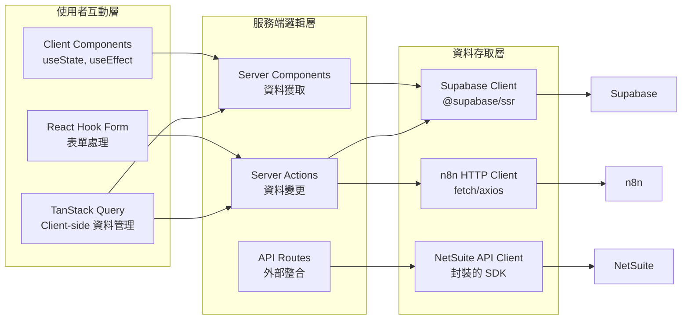
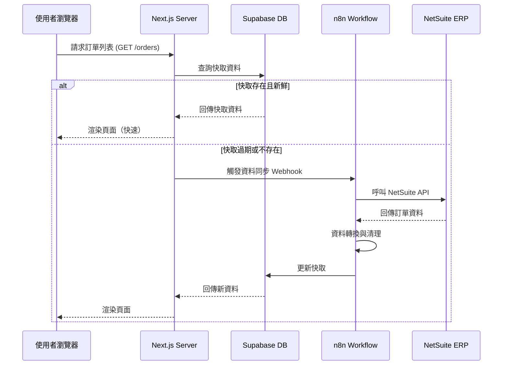
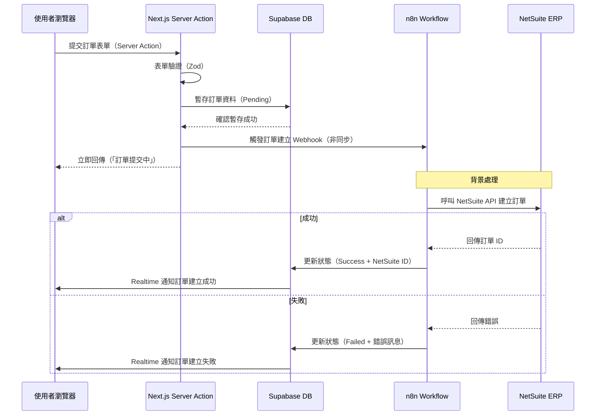
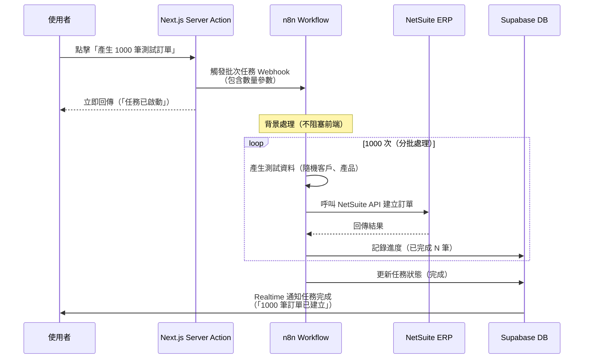
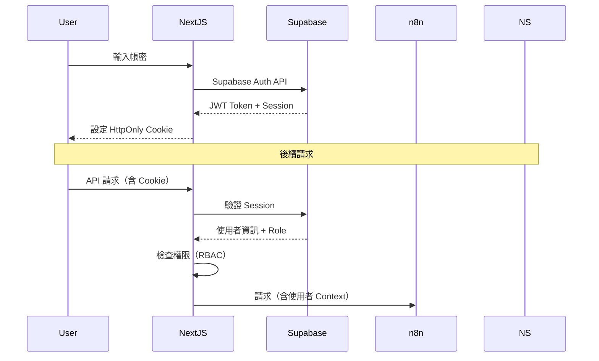
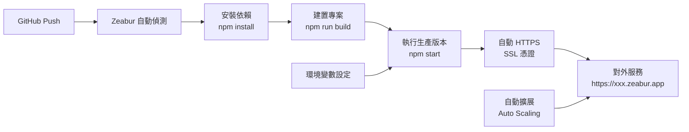

# NetSuite ERP 中台管理系統 - 詳細架構設計

## 一、系統整體架構圖

```mermaid
graph TB
    subgraph "前端層 (Presentation Layer)"
        A[使用者瀏覽器<br/>Desktop/Mobile]
        B[Next.js 14 App Router<br/>TypeScript + React]
        
        subgraph "Next.js 內部架構"
            B1[App Router<br/>app/]
            B2[Server Components<br/>SSR/SSG]
            B3[Client Components<br/>Interactive UI]
            B4[Server Actions<br/>服務端邏輯]
            B5[API Routes<br/>app/api/]
        end
        
        B --> B1
        B1 --> B2
        B1 --> B3
        B1 --> B4
        B1 --> B5
        
        A -->|HTTPS| B
    end
    
    subgraph "認證與資料層 (Data Layer)"
        C[Supabase]
        C1[Supabase Auth<br/>使用者認證]
        C2[Supabase Database<br/>PostgreSQL<br/>快取與暫存]
        C3[Supabase Realtime<br/>即時訂閱]
        C4[Supabase Storage<br/>檔案儲存]
        
        C --> C1
        C --> C2
        C --> C3
        C --> C4
    end
    
    subgraph "整合與流程層 (Integration Layer)"
        D[n8n Workflow Automation]
        D1[Webhook Listeners<br/>接收前端請求]
        D2[Data Transformation<br/>資料格式轉換]
        D3[NetSuite Connector<br/>API 呼叫]
        D4[Schedule Tasks<br/>排程任務]
        D5[Error Handling<br/>錯誤處理與重試]
        
        D --> D1
        D --> D2
        D --> D3
        D --> D4
        D --> D5
    end
    
    subgraph "後端層 (Backend Layer)"
        E[NetSuite ERP]
        E1[SuiteScript API<br/>RESTlet/Suitelet]
        E2[SOAP/REST API<br/>標準 API]
        E3[產品主檔<br/>Item Master]
        E4[客戶主檔<br/>Customer Master]
        E5[訂單管理<br/>Sales Orders]
        
        E --> E1
        E --> E2
        E --> E3
        E --> E4
        E --> E5
    end
    
    subgraph "部署與 CI/CD"
        F[GitHub Repository]
        G[Zeabur Platform]
        G1[自動建置<br/>npm install]
        G2[自動部署<br/>npm run build]
        G3[環境變數管理]
        G4[自動擴展<br/>Auto Scaling]
        
        F -->|Git Push| G
        G --> G1
        G --> G2
        G --> G3
        G --> G4
    end
    
    %% 資料流向
    B -->|認證請求<br/>@supabase/ssr| C1
    B -->|查詢資料<br/>Supabase Client| C2
    B -->|即時訂閱<br/>Realtime Channels| C3
    B4 -->|批次任務<br/>HTTP Request| D1
    B5 -->|API 代理<br/>HTTP Request| D1
    
    D2 -->|轉換後資料| D3
    D3 -->|RESTlet/SuiteScript| E1
    D3 -->|SOAP/REST| E2
    
    E -->|同步資料| D2
    D2 -->|快取資料| C2
    
    G --> B
    F -.->|程式碼變更| B
```

---

## 二、Next.js 內部架構詳細設計

### 2.1 App Router 結構

```
app/
├── (auth)/                          # 路由群組（不影響 URL）
│   ├── login/
│   │   └── page.tsx                 # 登入頁面
│   └── layout.tsx                   # 認證頁面佈局
│
├── (dashboard)/                     # 主要功能路由群組
│   ├── layout.tsx                   # Dashboard 佈局（含 Sidebar）
│   ├── page.tsx                     # 首頁 / Dashboard
│   │
│   ├── orders/                      # 訂單管理模組
│   │   ├── page.tsx                 # 訂單列表（Server Component）
│   │   ├── [id]/
│   │   │   └── page.tsx             # 訂單詳情
│   │   ├── create/
│   │   │   └── page.tsx             # 建立訂單（表單）
│   │   └── actions.ts               # Server Actions（建立/更新訂單）
│   │
│   ├── products/                    # 產品主檔模組
│   │   ├── page.tsx                 # 產品列表
│   │   ├── [id]/
│   │   │   └── page.tsx             # 產品詳情/編輯
│   │   ├── create/
│   │   │   └── page.tsx             # 建立產品
│   │   └── actions.ts                # Server Actions（CRUD）
│   │
│   ├── customers/                   # 客戶主檔模組
│   │   ├── page.tsx                 # 客戶列表
│   │   ├── [id]/
│   │   │   └── page.tsx             # 客戶詳情/編輯
│   │   ├── create/
│   │   │   └── page.tsx             # 建立客戶
│   │   └── actions.ts                # Server Actions（CRUD）
│   │
│   └── simulator/                   # 交易模擬器模組
│       ├── page.tsx                 # 模擬器主頁
│       ├── batch-orders/
│       │   └── page.tsx             # 批量產生訂單頁面
│       └── actions.ts                # Server Actions（批次任務）
│
├── api/                              # API Routes（需要時使用）
│   ├── auth/
│   │   └── callback/
│   │       └── route.ts              # Supabase Auth Callback
│   ├── webhooks/
│   │   ├── n8n/
│   │   │   └── route.ts              # n8n Webhook 接收端
│   │   └── netsuite/
│   │       └── route.ts              # NetSuite Webhook（如需要）
│   └── netsuite/
│       └── proxy/
│           └── route.ts              # NetSuite API 代理（如需要）
│
├── layout.tsx                        # Root Layout（包含 Providers）
└── globals.css                       # 全域樣式（Tailwind）
```

---

### 2.2 技術元件分層架構



---

## 三、資料流向詳細設計

### 3.1 讀取流程（Read Flow）



### 3.2 寫入流程（Write Flow）



### 3.3 批次任務流程（Batch Process Flow）



---

## 四、技術 Stack 詳細清單

### 4.1 核心框架與工具

| 技術 | 版本 | 用途 | 安裝指令 |
|------|------|------|----------|
| **Next.js** | 14.2+ | 元框架（App Router） | `npx create-next-app@latest` |
| **TypeScript** | 5.3+ | 型別安全 | 內建於 Next.js |
| **React** | 18.2+ | UI 函式庫 | 內建於 Next.js |

### 4.2 UI 與樣式

| 技術 | 版本 | 用途 | 安裝指令 |
|------|------|------|----------|
| **Tailwind CSS** | 3.4+ | 原子化 CSS | `npm install -D tailwindcss` |
| **shadcn/ui** | latest | UI 元件（可複製） | `npx shadcn-ui@latest init` |
| **Radix UI** | (via shadcn) | 無樣式元件基座 | 自動安裝 |
| **Lucide React** | latest | 圖示庫 | `npm install lucide-react` |

### 4.3 表單與驗證

| 技術 | 版本 | 用途 | 安裝指令 |
|------|------|------|----------|
| **React Hook Form** | 7.50+ | 表單狀態管理 | `npm install react-hook-form` |
| **Zod** | 3.22+ | Schema 驗證 | `npm install zod` |
| **@hookform/resolvers** | latest | Zod 整合 | `npm install @hookform/resolvers` |

### 4.4 資料管理

| 技術 | 版本 | 用途 | 安裝指令 |
|------|------|------|----------|
| **TanStack Query** | 5.20+ | Server State 管理 | `npm install @tanstack/react-query` |
| **@supabase/ssr** | latest | Next.js 整合 | `npm install @supabase/ssr` |
| **@supabase/supabase-js** | 2.39+ | Supabase 客戶端 | `npm install @supabase/supabase-js` |

### 4.5 工具函式庫

| 技術 | 版本 | 用途 | 安裝指令 |
|------|------|------|----------|
| **date-fns** | 3.0+ | 日期處理 | `npm install date-fns` |
| **clsx** | 2.0+ | className 組合 | `npm install clsx` |
| **zod** | 3.22+ | Schema 驗證 | (已列於表單區) |

---

## 五、關鍵技術決策說明

### 5.1 為什麼用 Server Actions 而不是 API Routes？

**Server Actions 優勢：**
- ✅ **型別安全：** TypeScript 可以從 Server Action 推斷回傳型別
- ✅ **簡化開發：** 不需要手寫 `route.ts`，直接在元件內呼叫
- ✅ **自動 CSRF 保護：** Next.js 內建
- ✅ **表單整合：** 可以直接用 `<form action={createOrder}>`

**範例：**
```typescript
// app/orders/actions.ts
'use server'

export async function createOrder(formData: FormData) {
  // 驗證、處理、呼叫 Supabase/n8n
  // 直接在 Server 端執行，無需 API Route
}
```

### 5.2 為什麼用 Supabase 做快取層？

**Supabase 優勢：**
- ✅ **即時同步：** Realtime 功能讓前端自動更新
- ✅ **PostgreSQL：** 強大的查詢能力（JOIN、聚合函數）
- ✅ **Row Level Security：** 可以設定資料存取權限
- ✅ **Edge Functions：** 需要時可以在 Supabase 上寫後端邏輯

**快取策略：**
```sql
-- Supabase 資料表設計
CREATE TABLE cached_orders (
  id UUID PRIMARY KEY,
  netsuite_order_id TEXT UNIQUE,
  data JSONB,
  updated_at TIMESTAMPTZ,
  expires_at TIMESTAMPTZ  -- TTL 快取過期
);

-- 自動清理過期快取（Cron Job）
```

### 5.3 為什麼用 n8n 而不是直接呼叫 NetSuite？

**n8n 優勢：**
- ✅ **錯誤重試：** 自動處理 API 失敗重試
- ✅ **資料轉換：** 格式化 NetSuite 資料格式
- ✅ **排程任務：** 定期同步資料
- ✅ **可視化流程：** 不用寫程式碼就能調整邏輯
- ✅ **多系統整合：** 未來可以整合其他系統

**n8n Workflow 範例：**
```
Webhook (接收) 
  → 資料驗證 
  → 轉換格式 
  → 呼叫 NetSuite API 
  → 錯誤處理 
  → 更新 Supabase
```

---

## 六、安全性設計

### 6.1 認證流程



### 6.2 環境變數管理

```bash
# .env.local (本地開發)
SUPABASE_URL=https://xxx.supabase.co
SUPABASE_ANON_KEY=xxx
SUPABASE_SERVICE_ROLE_KEY=xxx  # 僅 Server 端使用
N8N_WEBHOOK_URL=https://n8n.xxx.com/webhook/xxx
NETSUITE_ACCOUNT_ID=xxx
NETSUITE_CONSUMER_KEY=xxx
NETSUITE_CONSUMER_SECRET=xxx
NETSUITE_TOKEN_ID=xxx
NETSUITE_TOKEN_SECRET=xxx

# Zeabur 上設定（透過 UI 或 CLI）
# 自動注入到部署環境
```

---

## 七、性能優化策略

### 7.1 前端優化

1. **Server Components 預設：** 減少 JavaScript Bundle
2. **Streaming SSR：** 漸進式載入頁面內容
3. **Image Optimization：** Next.js Image 元件自動優化
4. **Code Splitting：** 自動按路由分割程式碼

### 7.2 資料快取策略

```typescript
// 使用 TanStack Query 的快取
const { data } = useQuery({
  queryKey: ['orders'],
  queryFn: fetchOrders,
  staleTime: 5 * 60 * 1000, // 5 分鐘內不重新抓取
  cacheTime: 10 * 60 * 1000, // 快取保留 10 分鐘
});
```

### 7.3 Supabase 快取 TTL

```typescript
// Server Action 範例
export async function getOrders() {
  const { data } = await supabase
    .from('cached_orders')
    .select('*')
    .gt('expires_at', new Date().toISOString()); // 只取未過期資料
  
  if (data.length === 0) {
    // 觸發 n8n 同步
    await triggerSync();
  }
  
  return data;
}
```

---

## 八、部署架構

### 8.1 Zeabur 部署流程



### 8.2 環境配置

| 環境 | 用途 | 部署方式 |
|------|------|----------|
| **Development** | 本地開發 | `npm run dev` |
| **Preview** | PR 預覽 | Zeabur 自動建立（每個 PR） |
| **Staging** | 測試環境 | Zeabur Branch Deployment |
| **Production** | 正式環境 | Zeabur Main Branch |

---

## 九、監控與日誌

### 9.1 建議整合

- **Vercel Analytics：** 前端效能監控（如果需要的話）
- **Supabase Logs：** 資料庫查詢日誌
- **n8n Execution Logs：** Workflow 執行記錄
- **Zeabur Logs：** 應用程式運行日誌

---

## 十、下一步實作計劃

1. ✅ **專案初始化**
   - 建立 Next.js 專案
   - 設定 Tailwind + shadcn/ui
   - 配置 TypeScript

2. ⏭️ **Supabase 整合**
   - 建立 Supabase 專案
   - 設定認證
   - 設計資料表 Schema
   - 整合 @supabase/ssr

3. ⏭️ **n8n 整合**
   - 建立 n8n Workflows
   - 設定 NetSuite API Connector
   - 建立 Webhook Endpoints

4. ⏭️ **認證模組**
   - 實作登入頁面
   - Session 管理
   - Protected Routes

5. ⏭️ **核心功能模組**
   - 訂單管理
   - 產品主檔
   - 客戶主檔
   - 交易模擬器

6. ⏭️ **Zeabur 部署**
   - 連接 GitHub
   - 設定環境變數
   - 測試 CI/CD

---

**文件建立時間：** 2024
**版本：** 2.0
**架構設計者：** AI Assistant

